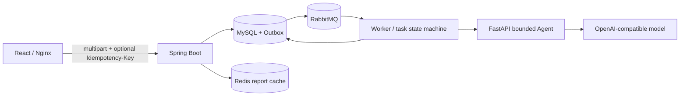

# 基于 Tool Calling Agent 的智能简历与岗位匹配系统

[](https://github.com/hoshisora1/ai-resume-match/actions/workflows/ci.yml)

这是一个可直接运行的全栈 AI Agent 应用。用户可在浏览器中上传 PDF/DOCX 简历、填写岗位信息、跟踪异步分析状态，并查看历史记录和 Markdown 匹配报告。Java 主系统负责事务、outbox、任务状态机和报告持久化；Python/FastAPI Agent 通过受限工具读取 JD、按需检索简历证据并提交结构化报告。原有单次 RAG 链路作为可配置回退保留。

## 30 秒导览

`上传简历与 JD → 幂等原子创建任务/outbox → RabbitMQ worker → 有界 Agent 检索证据并提交逐条引用的报告 → MySQL 持久化 → Redis 缓存查询 → React 轮询展示`

| 看点 | 仓库中的实现 |
| --- | --- |
| 完整产品闭环 | 上传、异步状态、失败重试、历史筛选、结构化报告与响应式页面 |
| 受限 Agent | 三个白名单工具、逐条 claim 引用、Pydantic 参数校验、调用顺序、step/tool/error 与 token/context budget、强制结构化终止 |
| 可靠业务主链路 | 幂等原子提交、MySQL 事实源、transactional outbox、RabbitMQ、陈旧 `RUNNING` 恢复、有限重试/`DEAD` 终态与 Redis cache-aside |
| 可复现证据 | Java/Python/React 分层测试、Testcontainers、确定性 Playwright 和 Compose 全栈浏览器验收 |

想快速运行产品可直接看“完整 Docker Compose 启动”；想核验工程质量可跳到“测试与验证”；Agent 的可信边界与面试证据见 `docs/agent-engineering-evidence.md`。

## 技术栈

Python 3.12+、FastAPI、Pydantic、httpx、pytest、Java 21、Spring Boot 3.3、Spring Data JPA、Flyway、MySQL、Redis、RabbitMQ、React 19、TypeScript、Vite、TanStack Query、React Hook Form、Zod、Nginx、Playwright、Docker Compose、JUnit 5、Testcontainers。

## 架构概览

- Spring Boot 主应用承载 API、用例编排、worker、状态机、数据和基础设施适配。
- Python/FastAPI Agent sidecar 实现有界 ReAct/Tool Calling 循环，只开放 `get_job_requirements`、`search_resume_evidence`、`submit_match_report` 三个工具。
- Agent 初始模型上下文只含 task ID；`coreClaims` / `matchedSkills` 中每条正向 claim 都必须携带本轮检索产生的 evidence ID，最终 Markdown 同时给出 claim 引用和 `ID -> 相关度 -> 已清理片段` 映射。
- 本地检索使用 exact-term guard 与最低相关度 `0.08`；不相关查询可返回空结果。无证据时允许生成不含正向 claim、分数不高于 30 的保守报告。
- runtime 对工具参数、调用顺序和 evidence ID 来源做确定性校验，并同时限制 step、工具调用、协议错误、单次生成 token、累计 provider-reported token 和累计上下文字符。
- 上传文件限制为 5 MB；提取后的简历正文按 Agent 请求契约限制为 200,000 个 Unicode code point，超限会在持久化和投递前被拒绝。
- `AnalysisEngine` 端口隔离 Java 业务流程与分析实现；`ANALYSIS_ENGINE=agent|legacy` 可切换 Agent 或原有 RAG 链路。
- MySQL 是简历、JD、分析任务、报告、提交幂等记录和 outbox 的事实来源。
- RabbitMQ 只传递 `taskId`，worker 从 MySQL 重新读取业务数据。
- outbox 投递有最大尝试次数；达到上限后事件进入不可自动认领的 `DEAD`，对应的 `PENDING` 任务转为 `FAILED_RETRYABLE/DELIVERY_FAILED`，可通过现有 retry 接口重建 outbox，并通过指标暴露积压。超时的 `RUNNING` 任务由调度器按状态/时间/attempt 条件恢复或终结。
- Redis 只做报告查询 cache-aside，缓存失败不影响业务结果。
- Flyway 管理 schema，运行时使用 `ddl-auto=validate`。
- React 前端提供总览、历史、幂等原子提交、状态轮询、失败重试和安全 Markdown 报告；页面级路由使用 `lazy` + `Suspense` 按需加载。
- Nginx 托管前端并代理同源 `/api`；`API_TOKEN` 只在代理边界注入，不进入浏览器 bundle 或存储。
- Docker Compose 可启动 frontend、app、agent、MySQL、Redis、RabbitMQ，并使用健康检查和持久化 volume。



## 完整 Docker Compose 启动

```powershell
Copy-Item .env.example .env
notepad .env
docker compose up -d --build
curl.exe -i http://localhost:3000/frontend-health
curl.exe -i http://localhost:8080/actuator/health/readiness
```

`.env` 中至少需要设置 `AI_API_KEY`、`API_TOKEN` 和 `AGENT_SERVICE_TOKEN`。示例值仅用于本地开发，不要提交真实 `.env`、真实 token 或真实 API key。

启动后访问：

- 产品前端：`http://localhost:3000`
- 后端 API/Actuator：`http://localhost:8080`
- Agent 健康检查：`http://localhost:8000/health`

浏览器只访问同源 Nginx。Nginx 在转发 `/api` 时注入 `X-API-Token`，前端代码不会读取或持久化 `API_TOKEN`。

停止服务：

```powershell
docker compose down
```

## 本机 Maven 开发启动

如需本机运行 Spring Boot 和 Agent、只用 Docker 启动数据依赖：

```powershell
Copy-Item .env.example .env
notepad .env
docker compose up -d mysql redis rabbitmq
$env:AI_API_KEY="replace-with-local-dev-key"
$env:AGENT_SERVICE_TOKEN="dev-agent-token"
Set-Location agent-service
py -3.13 -m venv .venv
.\.venv\Scripts\python.exe -m pip install -e ".[dev]"
.\.venv\Scripts\uvicorn.exe agent_service.main:app --port 8000
```

另开终端启动 Spring Boot：

```powershell
$env:SPRING_PROFILES_ACTIVE="dev"
$env:API_TOKEN="dev-token"
$env:ANALYSIS_ENGINE="agent"
$env:AGENT_SERVICE_TOKEN="dev-agent-token"
mvn spring-boot:run
```

`dev` profile 默认连接 `localhost` 上的 MySQL、Redis、RabbitMQ 和 Agent；`docker` profile 使用 Compose 服务名；`prod` profile 不包含本地默认凭据。若需验证旧链路，可设置 `ANALYSIS_ENGINE=legacy` 并让 Java 直接调用 AI endpoint。

前端本机开发：

```powershell
npm --prefix frontend ci
$env:API_PROXY_TARGET="http://localhost:8080"
$env:API_TOKEN="dev-token"
npm --prefix frontend run dev
```

`API_TOKEN` 由 Vite 开发代理读取并写入上游请求，不会通过 `VITE_*` 暴露给浏览器。

## 环境变量

| 变量 | 说明 | 示例 |
| --- | --- | --- |
| `FRONTEND_PORT` | Nginx 前端暴露端口 | `3000` |
| `APP_PORT` | app 暴露端口 | `8080` |
| `MYSQL_DATABASE` | MySQL database | `ai_resume_match` |
| `MYSQL_ROOT_PASSWORD` | MySQL root 密码 | `dev-root-password` |
| `MYSQL_USER` | 应用连接 MySQL 用户 | `ai_match` |
| `MYSQL_PASSWORD` | 应用连接 MySQL 密码 | `dev-mysql-password` |
| `REDIS_PASSWORD` | Redis 密码 | `dev-redis-password` |
| `RABBITMQ_DEFAULT_USER` | RabbitMQ 用户 | `ai_match` |
| `RABBITMQ_DEFAULT_PASS` | RabbitMQ 密码 | `dev-rabbit-password` |
| `API_TOKEN` | `X-API-Token` 校验值 | `dev-token` |
| `AI_API_KEY` | AI provider API key | `replace-with-your-dev-key` |
| `AI_ENDPOINT` | OpenAI-compatible endpoint | `https://api.openai.com/v1/chat/completions` |
| `AI_MODEL` | AI model name | `gpt-4o-mini` |
| `ANALYSIS_ENGINE` | 分析实现：`agent` 或 `legacy` | `agent` |
| `ANALYSIS_RUNNING_TIMEOUT` | `RUNNING` 任务被视为陈旧并进入恢复扫描前的超时 | `15m` |
| `ANALYSIS_OUTBOX_MAX_ATTEMPTS` | 单个 outbox 事件进入 `DEAD` 前的最大投递尝试数 | `10` |
| `AGENT_SERVICE_TOKEN` | Java 与 Agent 间的内部鉴权 token | `dev-agent-token` |
| `AGENT_SERVICE_PORT` | Agent 暴露端口 | `8000` |
| `AGENT_MAX_STEPS` | 单次 Agent 最大模型轮次 | `6` |
| `AGENT_MAX_TOOL_CALLS` | 单次 Agent 最大工具调用数 | `8` |
| `AGENT_MAX_PROTOCOL_ERRORS` | 允许的非法/拒绝调用次数 | `2` |
| `AGENT_MAX_COMPLETION_TOKENS` | 每次模型调用的最大生成 token 数 | `1200` |
| `AGENT_MAX_TOTAL_TOKENS` | 单次分析累计 provider-reported token 硬上限 | `50000` |
| `AGENT_MAX_CONTEXT_CHARS` | 单次分析累计发送模型上下文字符硬上限 | `100000` |

若 provider 未返回完整 usage，响应中的 `modelUsage.providerReported` 为 `false`，token 数仅表示已报告部分，不能视为精确账单；上下文字符预算仍独立生效。更多 outbox、retry 和 cache 参数见 `.env.example`。

## 核心接口

所有业务接口需要携带请求头：`X-API-Token: <API_TOKEN>`。

- `POST /api/resumes`：上传 PDF/DOCX 简历。
- `POST /api/jobs`：提交岗位名称和 JD；旧客户端只传 `content` 仍兼容。
- `POST /api/analysis`：根据已有简历/JD 创建异步任务，保留旧客户端兼容。
- `POST /api/analysis-submissions`：一次 multipart 请求原子创建简历、JD、任务和 outbox 事件，前端默认使用；可选 `Idempotency-Key` 会以 SHA-256 hash 存储，同 key/同请求指纹返回既有任务，同 key/不同指纹返回 `409 IDEMPOTENCY_CONFLICT`。前端在未修改表单的失败重试间复用同一个 key。
- `GET /api/analysis`：分页查询历史，可按状态筛选。
- `GET /api/analysis/summary`：查询总数、完成数、处理中、可重试失败和平均分。
- `GET /api/analysis/{taskId}`：查询任务状态。
- `GET /api/analysis/{taskId}/report`：查询匹配报告。
- `POST /api/analysis/{taskId}/retry`：手动重试可重试失败任务。

健康检查：

```powershell
curl.exe -i http://localhost:8080/actuator/health/readiness
```

readiness 只暴露 Spring 应用自身的接流量状态；MySQL、Redis、RabbitMQ 的容器健康由 Docker Compose healthcheck 管理，Redis 作为 cache-aside 依赖不可用时不应改变业务事实来源。

请求链路会返回 `X-Request-Id` 和 `X-Correlation-Id`。客户端可以传入这两个 header；缺失或非法时服务会生成安全 UUID。错误响应包含 `requestId`，便于在日志中定位同一次请求。任务失败对外只持久化按失败分类生成、清理控制字符并限制长度的安全消息；worker/Agent 生命周期日志记录异常类型而不是原始异常消息或模型正文。

常用指标入口：

```powershell
curl.exe -i http://localhost:8080/actuator/metrics
curl.exe -i http://localhost:8080/actuator/metrics/analysis.tasks.created
curl.exe -i http://localhost:8080/actuator/metrics/analysis.outbox.backlog
curl.exe -i http://localhost:8080/actuator/metrics/agent.calls
curl.exe -i http://localhost:8080/actuator/metrics/agent.call.duration
```

## 测试与验证

```powershell
mvn test
mvn verify

Set-Location agent-service
py -3.12 -m venv .venv
.\.venv\Scripts\python.exe -m pip install -e ".[dev]"
.\.venv\Scripts\python.exe -m pytest
Set-Location ..

npm --prefix frontend ci
npm --prefix frontend exec -- playwright install chromium
npm --prefix frontend run lint
npm --prefix frontend run typecheck
npm --prefix frontend run test
npm --prefix frontend run build
npm --prefix frontend run test:e2e
npm --prefix frontend run test:e2e:full-stack
docker compose --env-file .env.example config --quiet
docker build -t ai-resume-match:local .
```

首次运行 Playwright 必须先安装与项目配置一致的 Chromium；Linux/CI 可使用 `npx playwright install --with-deps chromium` 同时安装系统依赖。真实模型评测不属于无凭据 CI：进入 `agent-service` 目录并启动配置好 provider 的 Agent，再运行 `.\.venv\Scripts\python.exe evals\run_evals.py --output eval-results\latest.json`。

| 验证层 | 命令 | 主要覆盖 | GitHub CI |
| --- | --- | --- | --- |
| Java fast tests | `mvn test` | 领域规则、用例、API、配置与适配器 | 是 |
| Java 基础设施集成 | `mvn verify` | Testcontainers 下的 Flyway、MySQL、outbox、RabbitMQ、Redis 与后端 E2E | 是 |
| Python Agent | `python -m pytest` | 工具协议、检索、护栏、Agent 循环、API 鉴权、HTTP 适配器与评测规则 | 是 |
| React 质量门禁 | `lint`、`typecheck`、`test`、`build` | 静态检查、运行时契约、组件行为与生产构建 | 是 |
| 确定性浏览器 E2E | `npm run test:e2e` | 浏览器内 mock 下的主流程、失败重试和桌面/移动端布局 | 是 |
| Compose 全栈 E2E | `npm run test:e2e:full-stack` | Nginx、Spring、MySQL、outbox、RabbitMQ、Agent mock、Redis 到浏览器的跨进程链路 | 是 |
| 合成 Agent eval | `evals/run_evals.py` | 5 个 case 的 grounding、工具顺序、注入抵抗、分数/step/延迟边界与 token usage | 否，需显式配置真实模型 |

Git 仓库根目录的 `../.github/workflows/ci.yml` 在 push 和 pull request 上配置了 Java fast、Java Testcontainers、Python Agent、前端质量/构建和浏览器 E2E 五类并行门禁，使用 Maven、pip、npm 缓存，并取消同一分支已经过时的运行。这里描述的是已提交的 CI 配置，不代表尚未展示的远程运行已经全绿。

## 已知边界

- 当前是本地/受控环境项目，没有真实用户量、线上 SLA、QPS、成本收益或匹配准确率数据。
- 检索使用 256 维 hashing 向量、exact-term guard 和最低相关度 `0.08`，不相关查询会返回空结果；它仍不等同于语义 embedding 或生产级向量数据库，当前阈值也未通过标注集完成质量校准。
- grounding 已将正向内容收敛为逐条 claim 引用，并校验 evidence ID 来自本轮非空检索；但尚未判断 claim 是否被对应片段语义蕴含，技能差距、建议和面试题仍是自由文本，因此不能声称“消除幻觉”。
- 5 个合成 eval case 是可执行评测脚手架；未提交真实模型运行结果，也没有基于人工标注数据集的质量结论。
- 文档解析仅支持可提取文本的 PDF/DOCX，不含 OCR、病毒扫描和完整数据保留/删除策略。
- `API_TOKEN` 适合本地演示或受控单用户部署，不是账号、OAuth、RBAC 或多租户身份系统。
- 异步链路通过陈旧 `RUNNING` 恢复、attempt 条件更新、outbox `DEAD` 与任务 `DELIVERY_FAILED` 同步降低永久卡住与无限重试风险；恢复期间仍可能重复外部模型工作，不承诺 exactly-once、绝不丢消息或未经故障注入/负载测试证明的可用性指标。

## 文档

- 当前工程化设计：`docs/superpowers/specs/2026-07-04-engineering-hardening-design.md`
- 前端产品设计：`docs/superpowers/specs/2026-07-10-frontend-product-experience-design.md`
- 当前开发入口：`docs/development.md`
- Agent 架构、可信边界与可验证项目证据：`docs/agent-engineering-evidence.md`
- Python Agent 说明：`agent-service/README.md`
- 运维手册：`docs/operations/runbook.md`
- 历史实现计划：`docs/superpowers/plans/2026-05-12-rag-resume-job-match.md`
