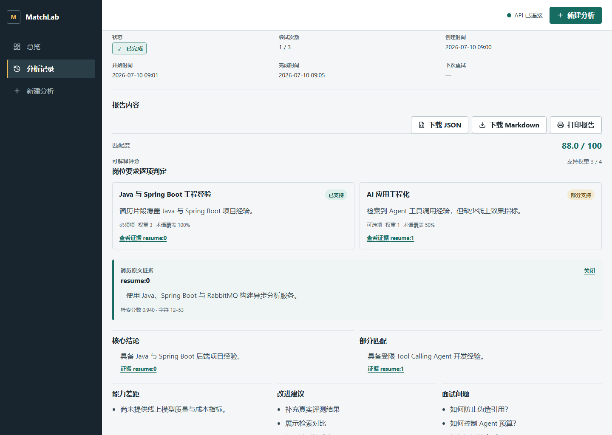
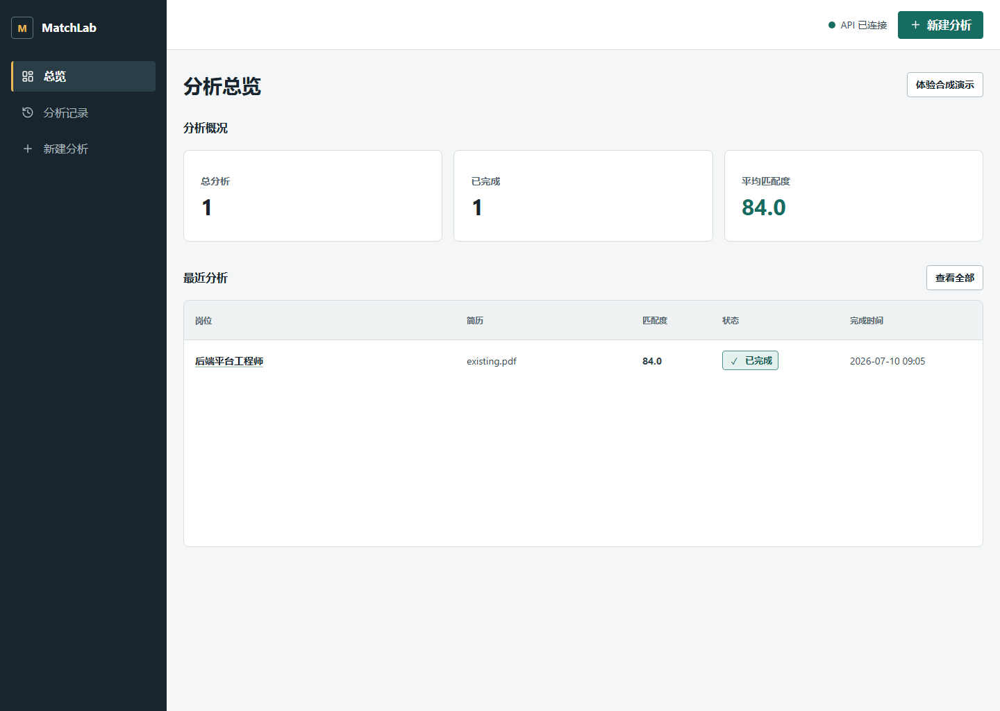
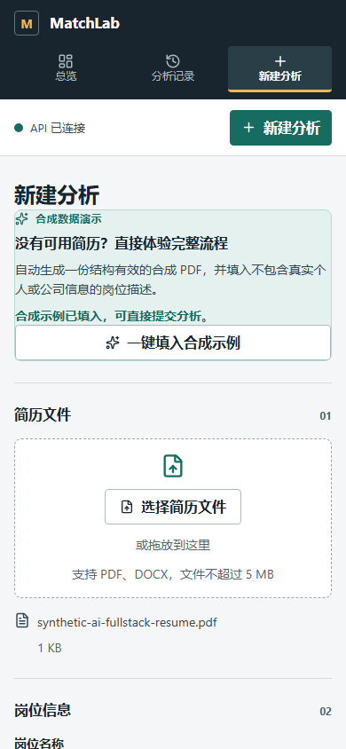
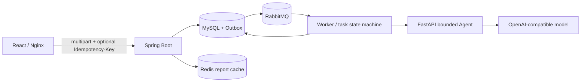

# 基于 Tool Calling Agent 的智能简历与岗位匹配系统

[](https://github.com/hoshisora1/ai-resume-match/actions/workflows/ci.yml)

这是一个可直接运行的全栈 AI Agent 应用。用户可在浏览器中上传 PDF/DOCX 简历、填写岗位信息、跟踪异步分析状态，并查看逐项要求、确定性计分、可点击证据和运行溯源。Java 主系统负责事务、outbox、任务状态机和版本化报告持久化；Python/FastAPI Agent 通过受限工具读取 JD、按需检索简历证据并提交结构化报告。原有单次 RAG 链路仅作为显式基线与兼容验证入口保留，不会自动降级切换。

## 30 秒导览

`上传简历与 JD → 幂等原子创建任务/outbox → RabbitMQ worker → 有界 Agent 检索证据并提交逐条引用的报告 → MySQL 持久化 → Redis 缓存查询 → React 轮询展示`

| 看点 | 仓库中的实现 |
| --- | --- |
| 完整产品闭环 | 上传、异步状态、失败重试、历史筛选、结构化报告、证据回查、JSON/Markdown 导出与打印 |
| 受限 Agent | 三个白名单工具、逐 requirement 检索与同项 evidence 绑定、确定性评分、Pydantic 参数校验、调用顺序和资源预算 |
| 可靠业务主链路 | 幂等原子提交、MySQL 事实源、transactional outbox、RabbitMQ、陈旧 `RUNNING` 恢复、有限重试/`DEAD` 终态与 Redis cache-aside |
| 可复现证据 | Java/Python/React 分层测试、Testcontainers、确定性 Playwright 和 Compose 全栈浏览器验收 |

想零配置体验可直接看“无付费合成 Demo”；连接真实模型时看“完整 Docker Compose 启动”；想核验工程质量可跳到“测试与验证”。Agent 的可信边界与面试证据见 `docs/agent-engineering-evidence.md`，独立人工 grounding 评测流程见 [`docs/claim-evidence-human-eval.md`](docs/claim-evidence-human-eval.md)。

## 产品界面

桌面端结构化报告把岗位要求判定、确定性分数、引用证据和安全导出放在同一视图中。点击下图可观看约 69 秒演示，包含合成提交、证据回查、运行溯源和可重试失败恢复：

[](docs/assets/portfolio/product-walkthrough.webm)

<details>
<summary>查看 Dashboard 与移动端合成 Demo</summary>





</details>

截图与无声 WebM 录屏由确定性浏览器 mock 生成，用于展示交互和响应式布局，不代表真实模型质量。运行 `npm --prefix frontend run capture:portfolio` 可更新截图；运行 `npm --prefix frontend run capture:portfolio-video` 可更新 1280×720、约 69 秒录屏。

## 技术栈

Python 3.12+、FastAPI、Pydantic、httpx、pytest、Java 21、Spring Boot 3.3、Spring Data JPA、Flyway、MySQL、Redis、RabbitMQ、React 19、TypeScript、Vite、TanStack Query、React Hook Form、Zod、Nginx、Playwright、Docker Compose、JUnit 5、Testcontainers。

## 架构概览

- Spring Boot 主应用承载 API、用例编排、worker、状态机、数据和基础设施适配。
- Python/FastAPI Agent sidecar 实现有界 ReAct/Tool Calling 循环，只开放 `get_job_requirements`、`search_resume_evidence`、`submit_match_report` 三个工具。
- Agent 初始模型上下文只含 task ID；运行时提取带 ID/must-have/weight 的 requirement，要求逐项检索和同项 evidence 引用。独立规则 verifier 检查关键术语覆盖与中英文否定表达，只允许保留或降级模型状态；再按固定 `supported/partial/not_found` 权重公式计算分数。最终响应给出模型/最终状态、验证原因与覆盖率、派生 claim/gap 和证据映射。
- 本地检索使用 exact-term guard 与最低相关度 `0.08`；不相关查询可返回空结果。所有 requirement 均为 `not_found` 时确定性得分为 0，报告不生成正向 claim。
- runtime 对工具参数、调用顺序和 evidence ID 来源做确定性校验，并同时限制 step、工具调用、协议错误、单次生成 token、累计 provider-reported token、累计上下文字符和单实例并发分析数。容量耗尽会在 provider 调用前快速返回结构化可重试错误。
- 上传文件限制为 5 MB；提取后的简历正文按 Agent 请求契约限制为 200,000 个 Unicode code point，超限会在持久化和投递前被拒绝。
- `AnalysisEngine` 端口隔离 Java 业务流程与分析实现；`ANALYSIS_ENGINE=agent|legacy` 可切换 Agent 或原有 RAG 链路。
- MySQL 是简历、JD、分析任务、报告、提交幂等记录和 outbox 的事实来源。
- RabbitMQ 只传递 `taskId`，worker 从 MySQL 重新读取业务数据。
- outbox 投递和 AI 任务失败都采用有上限的指数退避与 jitter。Agent 的结构化 `retryAfterSeconds` 会作为任务最短等待时间使用，并受本地最大退避上限约束，避免忽略 provider 限流窗口或接受异常长等待。outbox 达到最大尝试次数后进入不可自动认领的 `DEAD`，对应的 `PENDING` 任务转为 `FAILED_RETRYABLE/DELIVERY_FAILED`，可通过现有 retry 接口重建 outbox，并通过指标暴露积压。`PUBLISHED/DEAD` outbox 与安全可删除的幂等元数据默认保留 30 天后分批清理；关联活跃任务的幂等记录不会被清理。超时的 `RUNNING` 任务由调度器按状态/时间/attempt 条件恢复或终结。
- Redis 只做报告查询 cache-aside，缓存失败不影响业务结果。
- Flyway 管理 schema，运行时使用 `ddl-auto=validate`。
- Java 自定义配置集中绑定为 6 组 `@ConfigurationProperties + @Validated`；AI/Agent/API、限流、outbox、retention、缓存和上传边界不再分散读取 `@Value`。43 个必填叶子逐项缺失，以及 URL、secret、正数、jitter 和跨字段时间/资源预算非法时，应用都会在启动阶段失败。
- React 前端提供总览、历史、幂等原子提交、状态轮询、失败重试、requirement/claim 卡片、证据抽屉、运行溯源、白名单化 JSON/Markdown 导出和打印视图；运行溯源包含请求/运行时版本、任务范围输入指纹、Chat/Tool/总耗时和上下文预算，Java 会独立重算指纹并校验闭包。由结构化结果派生的安全 Markdown 同时作为兼容视图保留。页面级路由使用 `lazy` + `Suspense` 按需加载。
- Nginx 托管前端并代理同源 `/api`；`API_TOKEN` 只在代理边界注入，不进入浏览器 bundle 或存储。
- Docker Compose 可启动 frontend、app、agent、MySQL、Redis、RabbitMQ，并使用健康检查和持久化 volume。



## 无付费合成 Demo

不配置真实模型 key，也不上传真实简历即可运行完整产品链路：

```powershell
docker compose --env-file .env.example -f docker-compose.yml -f docker-compose.demo.yml up -d --build --wait
Start-Process http://localhost:3000
```

在 Dashboard 点击“体验合成演示”即可进入已填好安全示例的新建页；也可以在“新建分析”页面手动点击“一键填入合成示例”。系统会在浏览器内生成结构有效的合成 PDF，并填入明确标注为合成数据的岗位信息。提交后仍会真实经过 Nginx、Spring Boot、MySQL/outbox、RabbitMQ、Python Agent 三工具循环、Redis 和 React；只有外部 chat provider 被本地确定性服务替代，因此该模式用于功能展示，不代表真实模型效果。报告成功页的“再次分析”会创建全新任务并要求重新选择简历，不复用上一份浏览器文件。

Demo 仅将前端绑定到 `127.0.0.1:3000`，数据库、缓存、消息队列、Java 和 Agent 不映射宿主端口。如端口已占用，可先设置 `$env:DEMO_PORT="3100"`。停止并删除合成数据：

```powershell
docker compose --env-file .env.example -f docker-compose.yml -f docker-compose.demo.yml down -v
```

## 完整 Docker Compose 启动

```powershell
Copy-Item .env.example .env
notepad .env
docker compose up -d --build
curl.exe -i http://localhost:3000/frontend-health
curl.exe -i http://localhost:8080/actuator/health/readiness
```

`.env` 中至少需要设置 `AI_API_KEY`、`API_TOKEN`、`SESSION_SIGNING_KEY` 和 `AGENT_SERVICE_TOKEN`。示例值仅用于本地开发，不要提交真实 `.env`、真实 token 或真实 API key。

启动后访问：

- 产品前端：`http://localhost:3000`
- 后端 API/Actuator：`http://localhost:8080`
- Agent 健康检查：`http://localhost:8000/health`

浏览器只访问同源 Nginx。Nginx 在转发 `/api` 时注入 `X-API-Token`，该 token 只证明请求来自可信网关；Spring 另行签发 `HttpOnly + SameSite=Strict` 匿名会话 Cookie，按会话隔离简历、JD、任务、历史、汇总与报告。前端代码不会读取或持久化这两个凭证。

停止服务：

```powershell
docker compose down
```

## 本机 Maven 开发启动

如需本机运行 Spring Boot 和 Agent、只用 Docker 启动数据依赖：

```powershell
Copy-Item .env.example .env
notepad .env
docker compose up -d mysql redis rabbitmq
$env:AI_API_KEY="replace-with-local-dev-key"
$env:AGENT_SERVICE_TOKEN="dev-agent-token"
Set-Location agent-service
py -3.13 -m venv .venv
.\.venv\Scripts\python.exe -m pip install -e ".[dev]"
.\.venv\Scripts\uvicorn.exe agent_service.main:app --port 8000
```

另开终端启动 Spring Boot：

```powershell
$env:SPRING_PROFILES_ACTIVE="dev"
$env:API_TOKEN="dev-token"
$env:ANALYSIS_ENGINE="agent"
$env:AGENT_SERVICE_TOKEN="dev-agent-token"
mvn spring-boot:run
```

`dev` profile 默认连接 `localhost` 上的 MySQL、Redis、RabbitMQ 和 Agent；`docker` profile 使用 Compose 服务名；`prod` profile 不包含本地默认凭据。若需验证旧链路，可设置 `ANALYSIS_ENGINE=legacy` 并让 Java 直接调用 AI endpoint。

前端本机开发：

```powershell
npm --prefix frontend ci
$env:API_PROXY_TARGET="http://localhost:8080"
$env:API_TOKEN="dev-token"
npm --prefix frontend run dev
```

`API_TOKEN` 由 Vite 开发代理读取并写入上游请求，不会通过 `VITE_*` 暴露给浏览器。

## 环境变量

| 变量 | 说明 | 示例 |
| --- | --- | --- |
| `FRONTEND_PORT` | Nginx 前端暴露端口 | `3000` |
| `APP_PORT` | app 暴露端口 | `8080` |
| `MYSQL_DATABASE` | MySQL database | `ai_resume_match` |
| `MYSQL_ROOT_PASSWORD` | MySQL root 密码 | `dev-root-password` |
| `MYSQL_USER` | 应用连接 MySQL 用户 | `ai_match` |
| `MYSQL_PASSWORD` | 应用连接 MySQL 密码 | `dev-mysql-password` |
| `REDIS_PASSWORD` | Redis 密码 | `dev-redis-password` |
| `REDIS_CONNECT_TIMEOUT` | Redis 建连失败上限；缓存不可用时快速回源 MySQL | `500ms` |
| `REDIS_COMMAND_TIMEOUT` | 单次 Redis 命令等待上限 | `500ms` |
| `RABBITMQ_DEFAULT_USER` | RabbitMQ 用户 | `ai_match` |
| `RABBITMQ_DEFAULT_PASS` | RabbitMQ 密码 | `dev-rabbit-password` |
| `API_TOKEN` | `X-API-Token` 校验值 | `dev-token` |
| `SESSION_SIGNING_KEY` | 匿名会话 HMAC 密钥；至少 32 字符，公网环境必须独立随机生成 | `change-before-sharing` |
| `SESSION_TTL` | 匿名会话有效期；到期后旧匿名数据不再可访问 | `30d` |
| `SESSION_COOKIE_SECURE` | HTTPS 部署必须设为 `true` | `false` |
| `ANALYSIS_RATE_LIMIT_MAX_REQUESTS` | 单匿名会话在窗口内可创建/重试的分析次数 | `5` |
| `ANALYSIS_RATE_LIMIT_WINDOW` | Redis 原子计数窗口 | `10m` |
| `AI_API_KEY` | AI provider API key | `replace-with-your-dev-key` |
| `AI_ENDPOINT` | OpenAI-compatible endpoint | `https://api.openai.com/v1/chat/completions` |
| `AI_MODEL` | AI model name | `gpt-4o-mini` |
| `ANALYSIS_ENGINE` | 分析实现：`agent` 或 `legacy` | `agent` |
| `ANALYSIS_SCHEDULING_ENABLED` | 是否启动 outbox、重试与恢复调度；测试显式关闭 | `true` |
| `ANALYSIS_RUNNING_TIMEOUT` | `RUNNING` 任务被视为陈旧并进入恢复扫描前的超时 | `15m` |
| `ANALYSIS_OUTBOX_MAX_ATTEMPTS` | 单个 outbox 事件进入 `DEAD` 前的最大投递尝试数 | `10` |
| `ANALYSIS_OUTBOX_LEASE_DURATION` | publisher 认领事件的租约时长，必须大于 Rabbit confirm timeout | `30s` |
| `ANALYSIS_OUTBOX_RETRY_DELAY` | outbox 首次失败后的基础退避 | `30s` |
| `ANALYSIS_OUTBOX_RETRY_MAX_DELAY` | outbox 指数退避上限 | `15m` |
| `ANALYSIS_OUTBOX_RETRY_JITTER_RATIO` | 退避随机扰动比例，取值 `0..1` | `0.2` |
| `ANALYSIS_RETRY_DELAY` | AI 任务第一次可重试失败的基础退避 | `1m` |
| `ANALYSIS_RETRY_MAX_DELAY` | AI 任务指数退避和上游 `retryAfterSeconds` 的共同上限 | `15m` |
| `ANALYSIS_RETRY_JITTER_RATIO` | AI 任务退避随机扰动比例，取值 `0..1` | `0.2` |
| `ANALYSIS_OUTBOX_RETENTION` | `PUBLISHED/DEAD` outbox 终态保留期 | `30d` |
| `ANALYSIS_IDEMPOTENCY_RETENTION` | 可安全删除的提交幂等记录保留期 | `30d` |
| `ANALYSIS_USER_DATA_RETENTION` | 终态任务及关联用户数据的最长保留期 | `30d` |
| `ANALYSIS_RETENTION_FIXED_DELAY_MS` | retention scheduler 两轮之间的固定延迟 | `3600000` |
| `ANALYSIS_RETENTION_BATCH_SIZE` | 每轮每类元数据最多删除数 | `200` |
| `SCHEDULER_SHUTDOWN_TIMEOUT` | 进程停机时等待当前调度任务完成的上限 | `10s` |
| `AGENT_SERVICE_TOKEN` | Java 与 Agent 间的内部鉴权 token | `dev-agent-token` |
| `AGENT_SERVICE_PORT` | Agent 暴露端口 | `8000` |
| `AGENT_READ_TIMEOUT` | Java 等待整次 Agent 分析的上限，必须大于 Agent 全局 deadline | `60s` |
| `AGENT_MODEL_TIMEOUT_SECONDS` | Agent 单次 provider 调用上限，必须小于全局 deadline | `45` |
| `AGENT_ANALYSIS_TIMEOUT_SECONDS` | 单次 Agent 分析全局 deadline | `50` |
| `AGENT_MAX_STEPS` | 单次 Agent 最大模型轮次 | `6` |
| `AGENT_MAX_TOOL_CALLS` | 单次 Agent 最大工具调用数 | `8` |
| `AGENT_MAX_PROTOCOL_ERRORS` | 允许的非法/拒绝调用次数 | `2` |
| `AGENT_MAX_COMPLETION_TOKENS` | 每次模型调用的最大生成 token 数 | `1200` |
| `AGENT_MAX_TOTAL_TOKENS` | 单次分析累计 provider-reported token 硬上限 | `50000` |
| `AGENT_MAX_CONTEXT_CHARS` | 单次分析累计发送模型上下文字符硬上限 | `100000` |
| `AGENT_MAX_CONCURRENT_ANALYSES` | 单个 Agent 进程允许同时运行的付费分析数 | `4` |
| `AGENT_CAPACITY_ACQUIRE_TIMEOUT_SECONDS` | 等待本进程分析容量的最长时间，超时则在 provider 调用前拒绝 | `0.1` |
| `AGENT_MODEL_PRICING_VERSION` | 可选价格来源/生效日期版本；与两项单价同时配置才启用成本估算 | 空 |
| `AGENT_MODEL_INPUT_COST_USD_PER_MILLION_TOKENS` | 可选输入 token 美元单价，不硬编码供应商价格 | 空 |
| `AGENT_MODEL_OUTPUT_COST_USD_PER_MILLION_TOKENS` | 可选输出 token 美元单价，不硬编码供应商价格 | 空 |
| `TRACING_ENABLED` | Java W3C/OTLP tracing 开关；基础 Compose 默认关闭 | `false` |
| `AGENT_TRACING_ENABLED` | Python Agent tracing 开关；observability overlay 自动开启 | `false` |
| `TRACING_SAMPLING_PROBABILITY` | Java 根 span 采样率，范围 `0..1` | `1.0` |
| `OTEL_TRACES_SAMPLER_ARG` | Agent 根 span 采样率；有父上下文时继承采样决定 | `1.0` |
| `OTEL_EXPORTER_OTLP_TRACES_ENDPOINT` | Java/Agent OTLP HTTP trace 接收地址 | `http://tempo:4318/v1/traces` |
| `TEMPO_PORT` | 本地 Tempo 查询 API 端口，仅绑定回环地址 | `3200` |
| `RETRIEVER_MODE` | Agent 检索实现：默认 `hashing`，或显式启用 `hybrid` | `hashing` |
| `EMBEDDING_ENDPOINT` | hybrid 使用的 OpenAI-compatible embedding endpoint | `https://api.openai.com/v1/embeddings` |
| `EMBEDDING_API_KEY` | embedding key；留空时复用 `AI_API_KEY` | `replace-with-your-dev-key` |
| `EMBEDDING_MODEL` | 写入 retriever 版本与评测 artifact 的 embedding model | `text-embedding-3-small` |
| `EMBEDDING_TIMEOUT_SECONDS` | 单批 embedding 上限，必须小于 Agent 全局 deadline | `15` |
| `EMBEDDING_BATCH_SIZE` | 单次 embedding 请求最大文本数 | `64` |
| `DENSE_MIN_SIMILARITY` | dense 分支最低 cosine 相似度 | `0.35` |
| `RESUME_MAX_FILE_SIZE` | 上传文件业务大小上限 | `5MB` |
| `RESUME_MAX_PDF_PAGES` | 单份 PDF 最大页数 | `50` |
| `RESUME_MAX_DOCX_ENTRIES` | DOCX ZIP 最大 entry 数 | `512` |
| `RESUME_MAX_DOCX_ENTRY_SIZE` | DOCX 单 entry 最大解压体积 | `10MB` |
| `RESUME_MAX_DOCX_UNCOMPRESSED_SIZE` | DOCX 累计最大解压体积 | `20MB` |

若 provider 未返回完整 usage，响应中的 `modelUsage.providerReported` 为 `false`，token 数仅表示已报告部分，不能视为精确账单；上下文字符预算仍独立生效。只有三项定价配置同时存在且 usage 完整时，系统才返回 `estimatedCostUsd + pricingVersion`、写入 provenance 并累计 Prometheus 美元估算；否则两字段保持 `null`。当前估算只覆盖 chat provider 报告的 prompt/completion token，不包含 embedding、缓存 token 特价、存储、网络、税费或其他计费项；Prometheus 使用浮点累计，报告中的 Decimal 字符串才是单次工程估算的权威值。它不是 provider 账单对账结果。更多 outbox、retry 和 cache 参数见 `.env.example`。

## 核心接口

所有业务接口需要可信网关注入 `X-API-Token: <API_TOKEN>`。首次授权请求会签发匿名会话 Cookie；浏览器自动保存，命令行多步调用必须使用同一个 cookie jar。匿名会话是公开 Demo 的数据隔离边界，不等同于可找回的正式账户；需要跨设备身份、登录和账户恢复时应替换为 OIDC/JWT。

- `POST /api/resumes`：上传 PDF/DOCX 简历。
- `POST /api/jobs`：提交岗位名称和 JD；旧客户端只传 `content` 仍兼容。
- `POST /api/analysis`：根据同一匿名会话拥有的简历/JD 接受异步任务，返回 `202 Accepted`、任务 DTO 和 `Location: /api/analysis/{taskId}`，保留旧客户端兼容。
- `POST /api/analysis-submissions`：一次 multipart 请求原子创建简历、JD、任务和 outbox 事件，返回 `202 Accepted + Location`，前端默认使用；可选 `Idempotency-Key` 会以 SHA-256 hash 存储，同 key/同请求指纹返回既有任务，同 key/不同指纹返回 `409 IDEMPOTENCY_CONFLICT`。前端在未修改表单的失败重试间复用同一个 key。
- `GET /api/analysis`：分页查询历史，可按状态筛选。
- `GET /api/analysis/summary`：查询总数、完成数、处理中、可重试失败和平均分。
- `GET /api/analysis/{taskId}`：查询任务状态。
- `GET /api/analysis/{taskId}/report`：查询匹配报告；Agent 新报告返回 `reportSchemaVersion=match-report-v2`、`structuredReport` 与不含正文/工具参数/隐藏推理的 `provenance`，旧 Markdown 报告返回 `markdown-v1` 和空结构化字段。输入指纹是 task-scoped 的一致性证据，不是加密或完整重放快照，详见 [Agent 运行溯源](docs/run-provenance.md)。
- `POST /api/analysis/{taskId}/retry`：手动重试可重试失败任务。
- `DELETE /api/analysis/{taskId}`：永久删除当前匿名会话拥有的任务、报告、缓存、幂等/outbox 记录，并删除不再被其他任务引用的简历和 JD；不存在或跨会话统一返回 404。

创建分析、原子提交和手动重试共享按匿名会话计算的 Redis 配额。超限返回 `429 RATE_LIMIT_EXCEEDED + Retry-After`，且不会进入任务创建或 provider 链路；Redis 无法执行原子配额检查时，付费入口失败关闭并返回 `503 RATE_LIMIT_UNAVAILABLE`。报告读取仍按 cache-aside 从 MySQL 降级。

上传入口会同时校验扩展名与内容签名；DOCX 必须包含标准 Word 部件，并在交给 POI 前完成 entry 数、单 entry 和累计解压体积检查，PDF 在抽取前检查页数。DOCX 普通段落与表格单元格都会进入检索正文。Flyway V9 已删除曾与 `raw_text` 重复的 `structured_summary`，原始提取文本只保存一份并受用户数据保留策略管理。在调用 Agent 或 legacy AI 引擎前，系统会对带标签的姓名/地址/受保护属性、邮箱、电话和中国居民身份证号做确定性 best-effort 脱敏。日志只记录脱敏总数，指标 `analysis.model.input.redactions{type}` 只按类别计数，不保存原值。

健康检查：

```powershell
curl.exe -i http://localhost:8080/actuator/health/readiness
```

readiness 同时检查 Spring `readinessState` 和 MySQL `db`；数据库不可用时应用不会继续接收业务流量。Redis、RabbitMQ 的容器健康仍由 Docker Compose healthcheck 管理，其中 Redis 作为 cache-aside 依赖不参与 readiness，短暂不可用时报告读取会有界回源 MySQL。

请求链路会返回 `X-Request-Id` 和 `X-Correlation-Id`。客户端可以传入这两个 header；缺失或非法时服务会生成安全 UUID。已处理的 API 错误统一返回 `application/problem+json`，包含 RFC 9457 的 `type/title/status/detail/instance`、稳定业务 `code`、`requestId`，并在滚动升级期保留兼容字段 `message`。任务失败对外只持久化按失败分类生成、清理控制字符并限制长度的安全消息；worker/Agent 生命周期日志记录异常类型而不是原始异常消息或模型正文。测试还会静态检查自有 Java/Python telemetry 语句，并用正文 canary 覆盖两端成功链路的捕获日志。

开发环境可通过 `/v3/api-docs` 查看 OpenAPI；`prod` profile 默认关闭，只有显式设置 `OPENAPI_DOCS_ENABLED=true` 才开放。`api/openapi.json` 是提交到仓库的规范快照，前端生成类型位于 `frontend/src/shared/api/generated/`。`match-report-v2` 与 `analysis-run-v1` 已使用显式 OpenAPI wire DTO 描述 requirement/evidence/score/provenance/run metadata，不再退化为任意 `JsonNode`；Zod schema 通过 `satisfies` 和双向精确类型断言绑定生成类型。

常用指标入口：

```powershell
curl.exe -i http://localhost:8080/actuator/metrics
curl.exe -i http://localhost:8080/actuator/prometheus
curl.exe -i http://localhost:8080/actuator/metrics/analysis.tasks.created
curl.exe -i http://localhost:8080/actuator/metrics/analysis.outbox.backlog
curl.exe -i http://localhost:8080/actuator/metrics/analysis.outbox.oldest.age
curl.exe -i http://localhost:8080/actuator/metrics/agent.calls
curl.exe -i http://localhost:8080/actuator/metrics/agent.call.duration
curl.exe -i http://localhost:8080/actuator/metrics/analysis.model.input.redactions
curl.exe -i http://localhost:8000/metrics
```

需要本地指标面板和规则告警时，叠加可选 observability Compose 文件：

```powershell
docker compose --env-file .env -f docker-compose.yml -f docker-compose.observability.yml up -d --build
```

Prometheus 默认位于 `http://localhost:9090`，Grafana 默认位于 `http://localhost:3001`，Tempo 查询 API 默认位于 `http://localhost:3200`；三者只绑定 `127.0.0.1`。Prometheus 同时抓取 Java `/actuator/prometheus` 和 Python Agent `/metrics`。Grafana 已预置 15-panel `AI Resume Match — Operations` dashboard 与 Tempo 数据源，其中包含分析并发容量、在途数量和容量拒绝趋势。overlay 自动开启 W3C/OTLP tracing：HTTP 创建任务时的 trace context 会持久化到 outbox，经 RabbitMQ producer/consumer 观察恢复，再穿过 Java `RestTemplate`、Python FastAPI 和 chat/embedding `httpx` 客户端；成功报告的 provenance/前端会显示可在 Grafana Explore 查询的 32 位 trace ID。自动 span 不采集请求/响应 body 或鉴权 header，测试用正文/token canary 校验自有链路属性；仍不要把凭据或个人数据放入 URL query。启动前请修改 `GRAFANA_ADMIN_PASSWORD`。当前仍是 24 小时本地 trace/本地规则能力，尚无 Alertmanager 外部通知、生产访问控制/保留策略或 provider 账单对账。

## 测试与验证

```powershell
mvn test
mvn verify

Set-Location agent-service
py -3.12 -m venv .venv
.\.venv\Scripts\python.exe -m pip install -e ".[dev]"
.\.venv\Scripts\python.exe -m pytest
.\.venv\Scripts\python.exe evals\run_retrieval_eval.py --summary-only
Set-Location ..

npm --prefix frontend ci
npm --prefix frontend exec -- playwright install chromium
npm --prefix frontend run lint
npm --prefix frontend run typecheck
npm --prefix frontend run api:check
npm --prefix frontend run test
npm --prefix frontend run build
npm --prefix frontend run test:e2e-protocol
npm --prefix frontend run test:e2e
npm --prefix frontend run test:e2e:full-stack
docker compose --env-file .env.example config --quiet
docker compose --env-file .env.example -f docker-compose.yml -f docker-compose.demo.yml config --quiet
docker build -t ai-resume-match:local .
```

首次运行 Playwright 必须先安装与项目配置一致的 Chromium；Linux/CI 可使用 `npx playwright install --with-deps chromium` 同时安装系统依赖。真实模型评测不属于无凭据 CI：进入 `agent-service` 目录并启动配置好 provider 的 Agent，再运行 `.\.venv\Scripts\python.exe evals\run_evals.py --output eval-results\latest.json`。

| 验证层 | 命令 | 主要覆盖 | GitHub CI |
| --- | --- | --- | --- |
| Java fast tests | `mvn test` | 领域规则、用例、API、配置与适配器 | 是 |
| Java 基础设施集成 | `mvn verify` | Testcontainers 下的 Flyway、MySQL 8.4 并发竞争、outbox/幂等 retention、RabbitMQ 断连恢复、worker 陈旧任务恢复、Agent HTTP 读超时、Redis 故障回源与后端 E2E | 是 |
| Python Agent | `python -m pytest` | 工具协议、检索、护栏、Agent 循环、API 鉴权、HTTP 适配器与评测规则 | 是 |
| 确定性 retrieval eval | `evals/run_retrieval_eval.py` | 60 个合成 query 的 span/qrels、Recall@5、MRR@5 与无证据误召回率 | 是，无需模型凭据 |
| OpenAPI 契约门禁 | `OpenApiContractTest`、`frontend api:check`、TypeScript exact-type gate | 后端规范快照、显式报告/provenance schema、`202 + Location`、Problem Details、生成类型与 Zod 无漂移 | 是 |
| React 质量门禁 | `lint`、`typecheck`、`test`、`build` | 静态检查、运行时契约、组件行为与生产构建 | 是 |
| 确定性浏览器 E2E | `npm run test:e2e` | 浏览器内 mock 下的主流程、失败重试和桌面/移动端布局 | 是 |
| Compose 全栈 E2E | `npm run test:e2e:full-stack` | Nginx、Spring、MySQL、outbox、RabbitMQ、真实 Python Agent、Redis 到浏览器；仅外部 chat provider 使用确定性替身 | 是 |
| 合成 Agent eval | `evals/run_evals.py` | 120 个版本化 case 的 grounding、工具顺序、60 条安全对抗、长文/格式/时效/缩写/伪造证据切片、分数稳定性、p50/p95 与 token usage | 否，需显式配置真实模型 |

Git 仓库根目录的 `../.github/workflows/ci.yml` 在 push 和 pull request 上配置了 Java fast、Java Testcontainers、Python Agent、前端质量/构建和浏览器 E2E 五类并行门禁，使用 Maven、pip、npm 缓存，并取消同一分支已经过时的运行。这里描述的是已提交的 CI 配置，不代表尚未展示的远程运行已经全绿。

## 已知边界

- 当前是本地/受控环境项目，没有真实用户量、线上 SLA、QPS、成本收益或匹配准确率数据。
- 默认检索仍使用 256 维 hashing、exact-term guard 和最低相关度 `0.08`；60-query 合成 qrels 基线为 Recall@5 `0.8864`、MRR@5 `0.8636`、无证据误召回率 `0.0000`，其中 5 个同义词 case 未召回。仓库已提供显式 `hybrid` 模式，以 provider dense cosine 与 hashing 做 RRF 融合并缓存单次分析内的文档/query vectors，但尚未提交真实 embedding provider 的 A/B artifact，因此当前不能声称语义召回已经提升或达到生产级向量检索质量。
- grounding 已将正向内容收敛为逐 requirement assessment，校验 evidence ID 来自同一 requirement 的本轮检索，并以否定感知规则 verifier 做保守降级，再由代码派生 claim/gap 与计算总分；但该 verifier 尚未在人工标注集上校准，也不理解完整同义改写，建议和面试题仍是自由文本，因此不能声称“消除幻觉”。
- 120 个 `agent-live-eval-v4` 合成 case 与可重复 runner 仍只是需真实模型凭据的评测能力；其中 60 条安全对抗用例不等于真实攻击通过率。仓库尚未提交 provider 运行结果，也没有 claim 语义支持率或人工标注的端到端质量结论。
- 文档解析仅支持可提取文本的 PDF/DOCX，已具备内容签名、PDF 页数、DOCX 解压资源边界与表格抽取，但不含 OCR、页眉/页脚完整抽取或病毒扫描。模型输入前的规则脱敏是纵深防御，不是完整 NER/隐私合规保证；未带标签的姓名、非标准地址或图片中的信息可能无法识别。100 组仅改变带标签姓名、性别、年龄的反事实测试证明脱敏后的 provider 输入一致，不证明真实模型输出公平。原文仍按用户数据策略保存，用户可主动删除，数据默认最长保留 30 天。
- `API_TOKEN` 适合本地演示或受控单用户部署，不是账号、OAuth、RBAC 或多租户身份系统。
- 异步链路通过陈旧 `RUNNING` 恢复、attempt 条件更新、outbox `DEAD` 与任务 `DELIVERY_FAILED` 同步降低永久卡住与无限重试风险。outbox 认领和结果更新是带 token fencing 的短事务，Rabbit confirm 在事务外等待；已验证 broker 断连恢复、并发发布时无长事务阻塞、重复投递、Agent 读超时、“worker 认领后终止”恢复，以及 Rabbit ACK 后、结果落库前终止留下的 lease 过期重领。最后一种窗口会产生两条消息，但 worker 只执行一次 AI 并保留一份报告。Redis 不可用时也已验证在有界超时内回源 MySQL 并在恢复后重新缓存。仍未完成完整负载测试，不承诺 exactly-once、绝不丢消息或未经验证的可用性指标。

## 文档

- 面试导向的项目 Case Study：`docs/case-study.md`
- 当前工程化设计：`docs/superpowers/specs/2026-07-04-engineering-hardening-design.md`
- 前端产品设计：`docs/superpowers/specs/2026-07-10-frontend-product-experience-design.md`
- 当前开发入口：`docs/development.md`
- Agent 架构、可信边界与可验证项目证据：`docs/agent-engineering-evidence.md`
- Agent 运行溯源、跨语言输入指纹与能力边界：`docs/run-provenance.md`
- 面向 AI 全栈简历项目的分阶段优化方案：`docs/portfolio-improvement-plan.md`
- Python Agent 说明：`agent-service/README.md`
- 运维手册：`docs/operations/runbook.md`
- 历史实现计划：`docs/superpowers/plans/2026-05-12-rag-resume-job-match.md`
