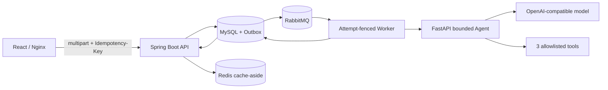
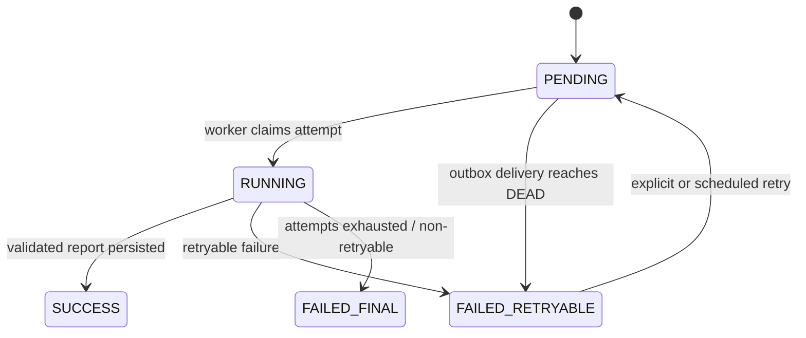

# AI 简历匹配 Agent：项目 Case Study

> 项目定位：AI 全栈个人项目，重点展示有界 Agent、可解释报告和可靠异步系统；不是线上招聘决策系统，也不声称具备生产流量或真实匹配准确率。

## 1. 问题与目标

普通“上传简历后调用一次大模型”的 Demo 很难回答四个问题：

1. 模型结论依据了简历中的哪段内容？
2. 模型乱调工具、伪造引用或超时时，系统如何收敛？
3. 消息重复、服务重启或缓存故障时，任务是否还能进入明确终态？
4. 招聘方如何在没有模型 Key、没有真实简历的情况下验证项目？

本项目因此把目标定义为：构建一个可运行、可解释、可回归的简历—岗位匹配产品闭环，并诚实区分“系统正确性证据”和“模型质量证据”。

## 2. 最终方案



Java 主系统管理事实数据、事务、任务状态和消息可靠性；Python sidecar 管理模型—工具循环、检索、验证和报告生成；React 只消费经过 Zod 再校验的 API 契约。

## 3. 关键决策

| 决策 | 选择 | 原因与取舍 |
| --- | --- | --- |
| Agent 边界 | 3 个白名单工具 | 模型可以决定检索 query、次数和提交时机，但不能直接访问数据库或任意网络能力 |
| 首轮上下文 | 只发送 task ID | JD 和简历证据通过工具返回并标记为不可信数据，缩小 prompt injection 面 |
| 评分 | requirement-centric 确定性公式 | 模型提出逐项状态，规则 verifier 只能保留或降级；最终分数由代码计算，避免模型自由打分 |
| 引用 | 同 requirement、同轮检索 ID | 合法 ID、闭包完整性和逐条 citation coverage 可被机器验证；语义蕴含仍需人工标注评测 |
| 异步可靠性 | MySQL transactional outbox + RabbitMQ | 创建任务和 outbox 在一个事务提交；允许 at-least-once，通过幂等与 attempt fence 控制重复影响 |
| 缓存 | Redis cache-aside | MySQL 保持事实源，Redis 下线不改变业务正确性 |
| 检索 | 默认 hashing，显式 hybrid | 默认模式无凭据且可复现；真实 dense embedding 必须经过同一 qrels A/B 后才能宣称提升 |
| 报告契约 | `match-report-v2` | Python、Java、MySQL、REST、Zod、React 保留 requirement/claim/evidence/score/provenance 图，Markdown 只做兼容视图 |
| 契约防漂移 | OpenAPI snapshot + generated TS + Zod exact type | Java 显式 wire DTO 展开报告/provenance，CI 逐段检查 Java→OpenAPI→生成类型→运行时 schema |
| 演示环境 | 真实 Agent + 确定性 chat provider | 无付费展示真实跨进程协议与产品链路，但不把确定性替身结果当作真实模型质量 |
| Demo 身份 | 签名 HttpOnly 匿名会话 | 网关 token 只认证 Nginx；数据库仅保存 session id hash，并在列表、详情、汇总、报告缓存前检查和重试中强制 owner 隔离。取舍是清 Cookie 后不可恢复，正式账户仍需 OIDC |
| 模型配额 | Redis Lua fail-closed 限次 | `INCR/PEXPIRE/PTTL` 原子完成，超限 429 且不创建任务；Redis 故障时付费入口 503，避免缓存降级语义被错误套用到费用控制 |

## 4. Agent 如何收敛

Agent 只允许执行：

1. `get_job_requirements`：读取 JD 和规范化 tags，提取最多 5 个稳定 requirement。
2. `search_resume_evidence`：按一个 `requirementId` 检索证据，返回带 offset 的片段。
3. `submit_match_report`：提交覆盖全部 requirement 的 assessments。

运行时同时限制 step、tool call、protocol error、单次 completion token、累计 provider token、累计上下文字符和整次 deadline。工具参数使用 Pydantic 严格校验，未知工具、未知 evidence ID、跨 requirement 引用和缺失 assessment 都会被拒绝。

提交后，版本化 verifier 检查关键术语覆盖和中英文否定表达，只允许把模型状态降为 `partial` 或 `not_found`。代码再按 requirement 权重计算分数；缺失 must-have 时应用高分上限。

## 5. 异步链路如何恢复



- multipart 提交支持幂等 key，相同请求不会创建两套任务。
- MySQL 8.4 Testcontainers 测试用准备阶段屏障强制两个请求都越过首次查询并竞争同一唯一键：相同 payload 返回同一 task；不同 payload 恰好一个成功、一个冲突，两种场景都只留下 1 组 resume、JD、task、outbox 和幂等记录。
- outbox publisher 使用 confirm/return；投递失败按有上限的指数退避与 jitter 重试，达到有限次数后进入 `DEAD` 终态。
- MySQL 8.4 + RabbitMQ Testcontainers 竞态测试让获胜 publisher 在事务外暂停 Rabbit 发送；另一个 publisher 可在网络等待期间完成而不被数据库事务阻塞，lease guarded update 仍只允许一次发送，队列最终只有 1 条消息。
- 重复消息双 worker 测试在获胜 worker 进入 AI 引擎后暂停执行；另一 worker 同时认领同一 task 会直接跳过，最终引擎只调用 1 次、`attemptCount=1` 且报告表只有 1 行。
- RabbitMQ 故障注入使用容器内 `rabbitmqctl stop_app/start_app` 真实关闭并恢复 broker application：断连时 outbox 落为 `FAILED` 且不误标发布；恢复并到达重试时间后事件转为 `PUBLISHED`，队列收到唯一有效消息。
- V7 migration 为 outbox 写入 `terminal_at`；分批 retention 只清理过期 `PUBLISHED/DEAD` 和未绑定/仅绑定终态任务的幂等元数据，真实 MySQL 8.4 测试确认关联活跃任务的幂等记录会保留。
- owner-scoped 删除 API 与前端二次确认复用同一事务删除服务；清理报告、缓存、幂等/outbox、任务和无共享引用的原始简历/JD。所有状态的用户数据默认最长保留 30 天，运行中删除后的迟到结果会被 task/attempt fence 拒绝。
- confirm/finalize 窗口测试在 Rabbit ACK 后立即抛出不被 publisher 捕获的终止错误：broker 已持久化第一条消息，而先前短事务提交的 outbox 保持 `PROCESSING + leaseToken + leaseUntil`。租约过期后恢复 publisher 以新 token 重领并再次发送，队列中存在两条同 task 消息，但 worker 只调用一次 AI，最终 `attemptCount=1` 且报告表只有 1 行。这是对进程终止持久状态的确定性故障模拟，不宣称跨 MySQL/RabbitMQ 的 exactly-once。
- Agent 超时测试启动真实本地 HTTP 服务并在收到请求后阻塞响应；Java 读超时后把任务落为 `FAILED_RETRYABLE/AI_UNAVAILABLE`，保留下次重试时间、使用安全用户消息且不生成报告。任务重试使用 capped exponential backoff 与 jitter；Agent 返回的 `retryAfterSeconds` 会端到端传到调度策略，作为受本地 15 分钟上限约束的最短等待时间。
- worker 更新带 attempt 条件，旧执行结果不能覆盖新一轮任务。
- worker 终止恢复测试模拟进程在原子认领后、调用 AI 前退出留下的持久状态：将该 `RUNNING` 行推进到 lease 超时后，恢复调度器会原子重置为 `PENDING` 并写入新 outbox；真实 RabbitMQ 重投后第二次 attempt 成功，最终只保留 1 份报告。
- 报告先写 MySQL，再失效 Redis；缓存错误不会回滚事实结果。Redis 容器被 pause 后，读写各在 500ms 命令超时内失败，报告接口仍在 3 秒内从 MySQL 返回；unpause 后下一次业务读取会重新写入缓存。

该设计仍是 at-least-once，不承诺 exactly-once。outbox 已用显式短租约和 token fencing 限制迟到写入；worker 超时恢复期间仍可能重复外部模型工作，后续需要 provider 幂等进一步降低重复成本。

## 6. 报告为什么可解释

`match-report-v2` 保存以下关系：

- requirement：文本、must-have、权重、模型状态、最终状态和 verifier 结果；
- grounded claim：正向结论及其 evidence IDs；
- evidence：清理后的引用片段、检索分数和字符 offset；
- score breakdown：supported/partial/missing 权重与 must-have cap；
- provenance：模型、Prompt/Retriever/Verifier/定价版本、步骤、token usage、估算成本、去参数化 tool trace、correlation/trace ID，以及 `agent-run-v1` 请求/运行时版本、task-scoped 输入指纹、Chat/Tool/总耗时和上下文预算。Java 会独立重算输入指纹并校验运行关系；该指纹不是加密或完整重放快照。

前端独立重算分数并检查 evidence 闭包。用户可从 requirement 或 claim 打开证据抽屉，也可下载白名单化 JSON、兼容 Markdown或打印报告。JSON 明确标记未包含源简历/JD；它仍含最终引用片段，因此依然应按候选人数据处理。

## 7. 如何验证

当前工作树的主要验证范围：

- Java：领域/用例/API、Flyway/MySQL、真实 InnoDB 并发竞争、RabbitMQ 断连恢复、confirm/finalize 租约恢复窗口、worker 终止状态恢复、Agent HTTP 读超时、Redis 故障回源/恢复和后端 E2E。
- Python：Agent 循环、工具协议、requirement、verifier、hashing/dense/RRF、embedding adapter、eval runner 与 HTTP 契约。
- React：Zod 契约、表单、轮询/错误恢复、结构化报告、证据交互、导出和响应式布局。
- Playwright：浏览器 mock 产品流程，以及 Compose 下真实 Nginx → Java → MySQL/outbox → RabbitMQ → Python Agent → Redis → React 链路。
- 检索基线：60 个合成 query，hashing Recall@5 `0.8864`、MRR@5 `0.8636`、无证据误召回率 `0.0000`。
- Live Agent eval：`agent-live-eval-v4` 的 120 个版本化合成 case runner 已就绪，含 50 条简历/JD 直接注入和共 60 条安全对抗用例，但仓库尚未提交真实 provider 结果。

这些结果证明实现和回归能力，不等于招聘质量、线上准确率、SLA 或真实用户规模。精确测试数量应在目标 commit 上统一复跑后再写入简历。

## 8. 无付费 Demo

```powershell
docker compose --env-file .env.example -f docker-compose.yml -f docker-compose.demo.yml up -d --build --wait
```

打开 `http://localhost:3000`，从 Dashboard 点击“体验合成演示”后直接提交；该深链只自动填充一次，用户编辑后不会被查询参数覆盖。浏览器生成的 PDF 和 JD 均明确标注为合成数据。报告完成后可通过“再次分析”进入空白新任务，上一份浏览器文件不会被复用。Demo 只把前端绑定到宿主回环地址，其他服务留在 Compose 网络中。

该模式使用真实 Agent runtime，但 chat provider 是确定性本地替身。它适合展示工具协议、异步链路、V2 报告和证据交互，不适合评估模型理解能力。

README 同时提供 68.8 秒无声演示录屏，覆盖成功路径、证据回查、运行溯源和可重试失败。录屏由浏览器 mock 生成以保证可重复性；可用 `npm --prefix frontend run capture:portfolio-video` 更新，不将其中分数作为模型质量证据。

## 9. 当前局限

- 当前匿名签名会话已经提供 owner 隔离、固定窗口配额、主动删除和默认 30 天保留，但不是账号、OIDC/RBAC、跨设备恢复、同时执行配额或日 token/美元预算，因此仍不应直接作为公网真实简历服务。
- 默认 hashing 检索不理解完整同义词或跨语言语义；hybrid 尚无真实 provider A/B artifact。
- 合法 citation ID 不等于 claim 被片段语义蕴含；规则 verifier 尚未用双人标注集校准。
- 文档解析已增加 PDF/DOCX 内容签名、PDF 页数、DOCX 解压资源限制和表格抽取；仍不含 OCR、页眉/页脚完整抽取、病毒扫描或独立解析沙箱。
- Java 在进入 Agent/legacy 引擎前会脱敏常见联系信息、身份证号和带标签的敏感属性，V9 也已删除重复正文列；规则型脱敏仍不是完整 NER/DLP 保证。100 组姓名/性别/年龄反事实只证明当前规则覆盖下的 provider 输入一致，不证明模型输出公平。
- Java 与 Python Agent 均已导出 Prometheus 指标；W3C trace context 会持久化穿过 outbox，并经 RabbitMQ、Java HTTP、FastAPI 延续到 chat/embedding provider。本地 Grafana 已接入 Prometheus/Tempo，报告 provenance 显示 trace ID。它仍只是 24 小时本地观测环境，没有生产访问控制、通知闭环或 provider 账单对账。
- 当前没有真实流量、用户反馈、线上 SLA 或公平性结论。

## 10. 下一步

优先级从高到低：

1. 建立 claim—evidence 双人标注集，并提交真实 provider live eval artifact。
2. 用同一 60-query qrels 运行真实 multilingual embedding hybrid A/B，再决定是否切换默认检索。
3. 用多语种标注语料评估并增强 PII redaction，在真实 provider 上做带统计阈值的输出公平性测试，并补并发/日预算配额；公网部署前仍需 OIDC 身份、病毒扫描与解析沙箱。
4. 将现有本地 OpenTelemetry/Tempo 与版本化成本估算升级为生产访问控制、保留/删除、采样策略、provider 账单对账和外部告警通知闭环。
5. 补依赖/SBOM/镜像扫描与可访问性门禁，并以负载/停机演练校准 outbox lease、退避和 retention 参数。

## 11. 简历表述边界

可以表述为：

- 实现有界、证据驱动的 Tool Calling Agent，并以逐 requirement 检索、保守 verifier 和确定性计分生成可解释报告。
- 打通 React、Spring Boot、FastAPI、MySQL/outbox、RabbitMQ、Redis 的异步 AI 应用链路。
- 通过版本化结构化契约、分层测试、检索基线和真实 Agent Compose E2E 建立可复现工程证据。

不要表述为“生产级语义 RAG”“消除幻觉”“自动 fallback”“线上准确率”或“真实用户规模”，除非之后获得对应证据。

进一步证据见：

- [Agent 工程证据](agent-engineering-evidence.md)
- [完整优化方案](portfolio-improvement-plan.md)
- [架构说明](architecture.md)
- [运维手册](operations/runbook.md)
